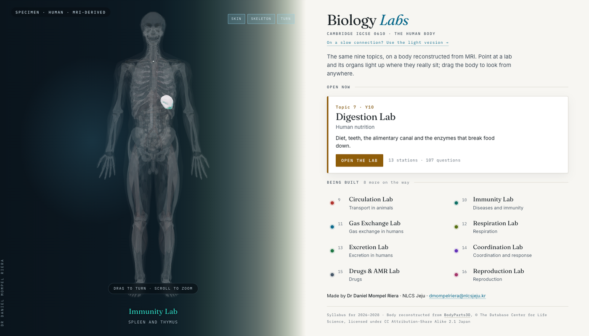
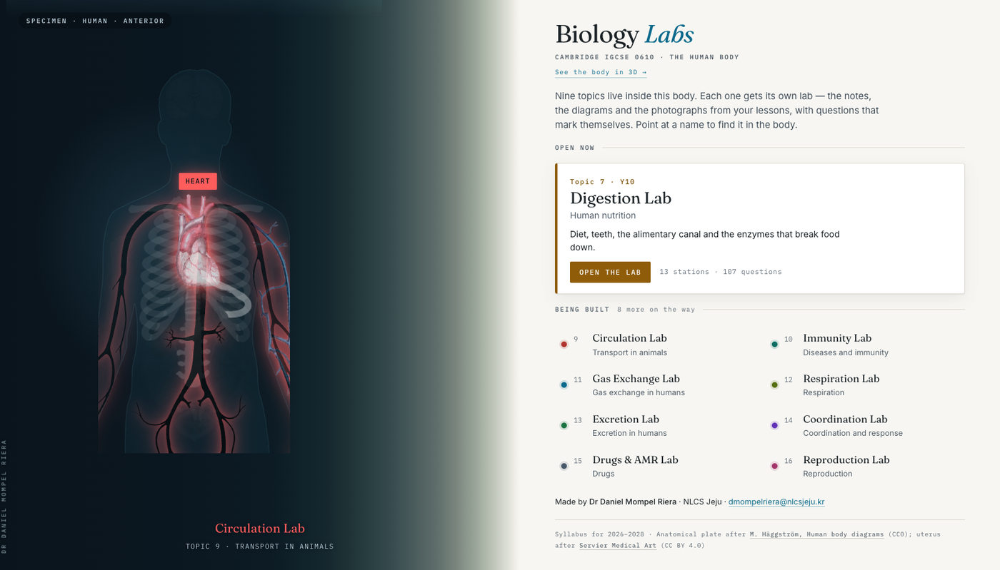

<div align="center">

# Biology Labs

**Interactive revision for Cambridge IGCSE Biology 0610 — the human body.**

Nine topics live inside one body. Point at a lab and its organs light up where they
really sit; open the lab and work through the topic with questions that mark themselves.

by **Dr Daniel Mompel Riera** · NLCS Jeju

[**→ Open the site**](https://mompel226.github.io/IGCSE-revision-app/) &nbsp;·&nbsp;
[Light version](https://mompel226.github.io/IGCSE-revision-app/plate.html) &nbsp;·&nbsp;
[Digestion Lab](https://mompel226.github.io/digestion-lab/)

</div>

---



The front door is a **human body reconstructed from MRI**. Drag it to turn it, scroll to
zoom, toggle the skin and skeleton away. Point at a lab on the right and that system
lights up in the body; point at an organ and its lab lights up in the list. Left alone,
it walks through the nine systems by itself.

---

## The light version

Not every student is on a fast connection, and the 3D page pulls 6 MB. So there is a
second front door: the same nine topics on a flat anatomical plate, 1.5 MB, which loads
instantly and even works opened straight from a memory stick.



The two pages link to each other, so nobody gets stuck on the heavy one.

---

## The nine topics

| # | Topic | Lab | Lights up |
|---|-------|-----|-----------|
| 7 | Human nutrition | **Digestion Lab** — [live](https://mompel226.github.io/digestion-lab/) | stomach, liver, gall bladder, pancreas, the whole gut |
| 9 | Transport in animals | Circulation Lab | heart, aorta, venae cavae, pulmonary and iliac vessels |
| 10 | Diseases and immunity | Immunity Lab | spleen, thymus |
| 11 | Gas exchange in humans | Gas Exchange Lab | trachea, bronchi, all five lung lobes, diaphragm |
| 12 | Respiration | Respiration Lab | thigh and calf muscle — where it actually happens |
| 13 | Excretion in humans | Excretion Lab | kidneys, ureters, bladder, renal vessels |
| 14 | Coordination and response | Coordination Lab | brain, eyes, optic nerves, pituitary, adrenals |
| 15 | Drugs | Drugs & AMR Lab | the bloodstream that carries them |
| 16 | Reproduction | Reproduction Lab | reproductive organs |

One is built. The other eight are on the way.

---

## The anatomy is measured, not drawn

The body is not an illustration of a body. It is **BodyParts3D** — organs segmented from
a real full-body MRI by the Database Center for Life Science in Japan. Every organ is a
separate mesh, and they all share the scanner's coordinate frame, so nothing is
positioned by hand: each organ sits where it was measured in the person it came from.

Structures are chosen by **FMA identifier** (Foundational Model of Anatomy), listed in
[`tools/model-build/manifest.py`](tools/model-build/manifest.py), so the selection can be
checked against the ontology rather than taken on trust.

**Checks that were run before shipping**

- **Laterality** — the left/right convention was derived from the two meshes whose names
  settle it, then 14 structures were tested. Liver, gall bladder and right lung on the
  body's right; stomach, spleen, heart and left lung on the left; trachea, pancreas and
  bladder on the midline. Thirteen as expected; the fourteenth, the descending aorta,
  came out 12 mm left of the midline — which is correct anatomy, not an error.
- **Vertical order** — brain → heart → liver → kidney → bladder → testis, strictly descending.
- **Facing** — sternum anterior to the thoracic vertebrae, so the body faces the viewer
  rather than being mirrored.

**What the dataset does not contain**, stated plainly rather than faked:

- It is a **male body** — no ovaries, uterus or oviducts. Topic 16 shows the male organs
  in 3D; the flat plate carries the female ones.
- **No spinal cord** — only its central canal, which would mislead if labelled as the cord,
  so it is left out.
- **No lymph nodes or tonsils** — Topic 10 shows spleen and thymus.

---

## Adding a lab

Edit **one file**: [`js/topics.js`](js/topics.js). Give the topic a `url`, set
`status: 'live'`, done — both pages pick it up.

```js
{ id:'circulation', no:9, year:'Y10', sys:'circulation', anchor:'o-heart',
  title:'Transport in animals', lab:'Circulation Lab',
  blurb:'Double circulation, the heart, blood vessels and what blood carries.',
  status:'live', url:'https://mompel226.github.io/circulation-lab/' },
```

Each lab is its own repository and its own site. The hub is the signpost.

---

## Layout

```
index.html                the front door — the 3D body
plate.html                the light version — the flat anatomical plate
js/topics.js              THE TOPIC REGISTER — the only file you edit to add a lab
js/body3d.js              the 3D scene: loading, lighting, picking, idle tour
js/hub.js                 the flat plate: hotspots, lighting, pinned labels, idle tour
css/hub.css               design tokens, both layouts, both colour sets
assets/model/body.glb     the MRI body — 40 organ groups, 345k triangles, 6.2 MB
assets/anatomy/           the flat plate and its organ paintings
tools/model-build/        rebuild the 3D body from BodyParts3D
tools/inline-plate.py     re-inline the flat plate into plate.html
docs/BUILD-NOTES.md       the long-form notes
```

**Running it locally.** `plate.html` opens by double-clicking. `index.html` does not —
browsers block module scripts and model loading from `file://` — so serve the folder:

```bash
python3 -m http.server 8744
```

---

## Sources and licences

| What | Source | Licence |
|------|--------|---------|
| The 3D body | [BodyParts3D](https://dbarchive.biosciencedbc.jp/en/bodyparts3d/desc.html), © The Database Center for Life Science | **CC BY-SA 2.1 Japan** |
| The flat plate | [M. Häggström, *Human body diagrams*](https://commons.wikimedia.org/wiki/Human_body_diagrams) | CC0 (public domain) |
| Uterus and ovaries | [Servier Medical Art](https://smart.servier.com) | CC BY 4.0 |
| 3D rendering | [three.js](https://threejs.org) | MIT |

> **ShareAlike applies to the body model.** `assets/model/body.glb` is a derivative of
> BodyParts3D, so publishing it licenses that file onward under CC BY-SA 2.1 Japan. The
> credit line in the page footer is part of that obligation — please keep it.

---

## Who made this

**Dr Daniel Mompel Riera** — Biology, North London Collegiate School Jeju.

Built for his Year 10 and 11 IGCSE Biology classes. Questions, corrections, or if
you'd like to use it with your own students, please get in touch:
**[dmompelriera@nlcsjeju.kr](mailto:dmompelriera@nlcsjeju.kr)**

© Dr Daniel Mompel Riera. The anatomical source material is licensed as set out
above; the site itself — its design, its writing and its questions — is his work.
